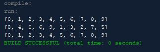

# SortArrayList

Sort ArrayList) Write the following method that sorts an ArrayList:
public static <E extends Comparable<E>>
  void sort(ArrayList<E> list)
  Basically the assignment wants to me again like the last assignment create a method that instead of shuffling
  it sorts the contents in whatever way you want to to be sorted, so like lets say you want it be ascending then
  you can put some numbers and have the numbers go from 0-10 or descending and have it go from 10-0.

## Example Output



## Analysis Steps

Well this assignment is similar to the other assignment but instead of shuffling you need to 
sort out the objects it was easy to analyze what I needed to do because all you need to do is mirror what you do
on the other assignment but add a little bit more to the program for it to work properly. Also the assignment gives you
the method so all you need to do is just do the rest within the method for it to work.

### Design

I used the method given to me and the main class plus another class which is the ArrayShuffle class
because I need that class to show that its sorting by comparing the differences.

```
System.out.println(list);
        ArrayListShuffle.shuffle(list);
        System.out.println(list);
        sort(list);
        System.out.println(list);
```

### Testing

Step 1:Create the Array
```
ArrayList<Integer> list = new ArrayList<>();

        for (int i = 0; i < 10; i++) {
            list.add(i);
```

Step 2: Add the method

```
 public static <E extends Comparable<E>> void sort(ArrayList<E> list)
```

Step 3: Sort the array method

```

        for (int i = 0; i < list.size() - 1; i++) {
            E currentMin = list.get(i);
            int min = i;
            for (int j = i + 1; j < list.size(); j++) {

                if (list.get(j).compareTo(currentMin) < 0) {
                    currentMin = list.get(j);
                    min = j;
                }
            }

            if (min != i) {
                list.set(min, list.get(i));
                list.set(i, currentMin);
```

Step 4: Print the lists sort/shuffle

```
  System.out.println(list);
        ArrayListShuffle.shuffle(list);
        System.out.println(list);
        sort(list);
        System.out.println(list);
```

You can use this data to see how it would work if you sorted out an array
like the picture that is shown above.

## Notes

No Issues or Notes

## Do not change content below this line
## Adapted from a README Built With

* [Dropwizard](http://www.dropwizard.io/1.0.2/docs/) - The web framework used
* [Maven](https://maven.apache.org/) - Dependency Management
* [ROME](https://rometools.github.io/rome/) - Used to generate RSS Feeds

## Contributing

Please read [CONTRIBUTING.md](https://gist.github.com/PurpleBooth/b24679402957c63ec426) for details on our code of conduct, and the process for submitting pull requests to us.

## Versioning

We use [SemVer](http://semver.org/) for versioning. For the versions available, see the [tags on this repository](https://github.com/your/project/tags). 

## Authors

* **Billie Thompson** - *Initial work* - [PurpleBooth](https://github.com/PurpleBooth)

See also the list of [contributors](https://github.com/your/project/contributors) who participated in this project.

## License

This project is licensed under the MIT License - see the [LICENSE.md](LICENSE.md) file for details

## Acknowledgments

* Hat tip to anyone who's code was used
* Inspiration
* etc
